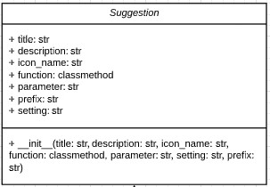
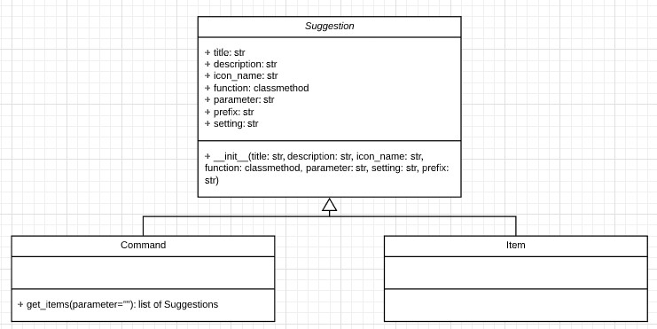
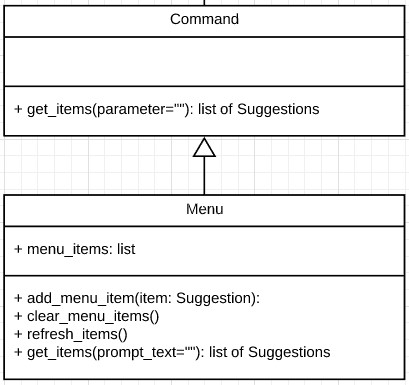

# Suggestions
Suggestions are the clickable rows which appear underneath the textbox prompt to visually help the user control
Spotify. There are two types of suggestion, **Command** and **Item**. A **Command Suggestion** is a suggestion which is
shown after the user types a word or phrase into the textbox prompt which partly or fully matches a command's prefix.
An **Item Suggestion** is a suggestion which is not invoked by typing into the textbox prompt but rather, is shown by
a Command Suggestion.

## Example

Suggestions fundamentally assist the user to control Spotify. They are presented with the following visual traits;
**icon**, **title** and **description**.
The following image shows a **Command Suggestion** as it is invoked via typing into the textbox prompt.

To understand how the suggestion is formed, it is important to understand the variables used inside of a base suggestion.

#### Suggestion Object

- `title`: The larger string displayed on the visual Suggestion example shown above
- `description`: The smaller string displayed on the visual Suggestion example shown above
- `icon_name`: The name of the icon stored in `assets/svg/` (do not include the .svg extension within this variable). The
`icon_name` can also be the id of an album, which finds the appropriate album art within `cache/art/`.
- `function`: This is a reference to a method within the `PlaybackManager` class. It is executed when the suggestion is clicked.
If there is no function needed, `None` can be assigned to the variable. The method reference will be called within the
`CommandHandler.perform_command()` method.
- `parameter`: Used as a parameter for the `function` classmethod reference. Leave blank if the function being used does
not take a variable.
- `setting`: defines what happens when the suggestion is clicked on. So far there are a couple of settings that can be
used globally:
    - `"fill"`: Pastes the prefix of the Suggestion into the textbox prompt
    - `"none"`: Does nothing
    - `"exe"`: Executes the function associated with the suggestion (function held within the `function` variable).

#### Commands and Items
Commands and Items both inherit from the Suggestion class. The difference between Commands and Items is that
Commands can be accessed by typing into the prompt, whereas Items are accessed and displayed from within
a Command. Item objects are returned from the `get_items(parameter="")` method of a Command. The parameter string is
the substring which comes after the prefix on the textbox prompt.

The `get_items(parameter="")` method of a command is the part which allows an item to be visualised. By default,
this method returns `[self]`. If the command must change or output other items then this method can be modified to
instantiate and return multiple items e.g. `[item1]`, `[item1, item2, self]` or any other combination up to the limit of 6.
See the `PlayCommand` in play.py as an example.

#### Menu
What makes the Menu class unique is its ability to show items when it is clicked. This class inherits from the Command
class.

`menu_items` can be refreshed just before they are displayed by overriding the refresh_items() method. Through this
method `menu_items` can be changed if its contents needs to be updated. See `DeviceCommand` in device.py as an example.

**It should be noted the `prompt_text` parameter in `get_items(prompt_text="")` retrieves all of the text in the prompt,
not just the text after the `prefix` like in other `get_items()` methods.**

